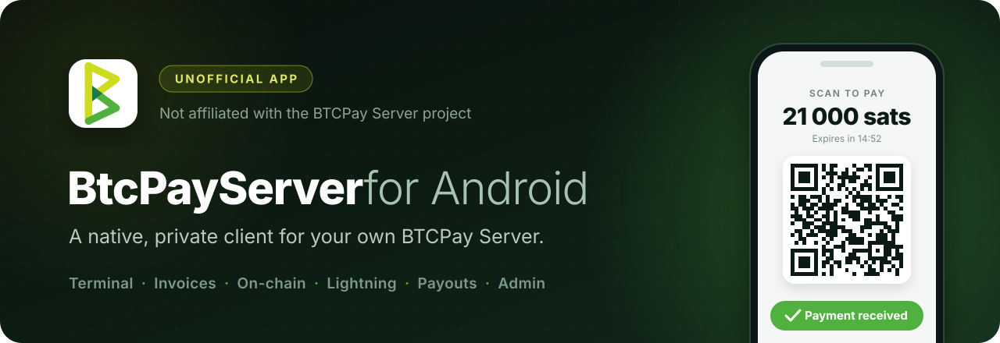

<p align="center">
  
</p>

<p align="center">
  <a href="https://github.com/Turtlecute33/btcpayapp/releases/latest"><b>Download</b></a>
  &nbsp;·&nbsp;
  <a href="#build">Build</a>
  &nbsp;·&nbsp;
  <a href="LICENSE">MIT licence</a>
</p>

> [!IMPORTANT]
> **This is an unofficial app.** It is a community project. The BTCPay Server
> Foundation and the BTCPay Server contributors do not make, endorse or support
> it. For the official project, go to [btcpayserver.org](https://btcpayserver.org).

## Features

- **Terminal**: keypad point of sale, tips, live checkout QR.
- **Invoices**: search, filters, refunds, payment requests, crowdfunds.
- **Wallets**: on-chain and Lightning, one Send screen for both.
- **Payouts**: pull payments, approvals, payout processors.
- **Admin**: stores, users, webhooks, email, server status.
- **Alerts**: payments, payouts and server notifications, checked by the phone.

## Privacy

- The app talks only to your server. No analytics, no crash reports, no push
  service, no Google Play services.
- API keys are encrypted with an Android Keystore key, kept in secure hardware
  when the phone has it.
- Biometric app lock, screenshot blocking, and a privacy mode that hides amounts.
- By default, sends, payouts and changes to where the store receives money ask
  for your fingerprint or PIN first.
- `http://` works only for `.onion` addresses. Every other server, also one on
  your LAN or on this phone, needs `https://`.

## Tor

`.onion` servers work through [Orbot](https://orbot.app).

- Start Orbot before you use a `.onion` account.
- Keep Orbot's SOCKS port at 9050.
- While Orbot is off, another app on the phone could listen on that port and
  read the traffic, including the API key.
- Background checks use that port too, also after the phone restarts. Keep
  Orbot always on, or turn off Settings > Background > "Check for activity in
  the background".

## Lightning node names

Channel and payment screens show node names from a directory inside the app,
so the app never asks an explorer about your peers. The directory is a snapshot
of the public graph, made with `scripts/build-node-directory.rb`;
`scripts/lnnodes.manifest.json` records its source, date and hash.

- Names are what each node calls itself. The payment confirmation shows only
  names you set and a short hand-checked list; other names show as "not
  verified".
- The generator removes aliases that copy a checked name. An alias that
  contains an exchange or service brand stays only on a large node (10 or more
  channels and 1 BTC or more).
- Tor-only nodes are listed only when they are in the public top 100 by
  capacity, channels or age.

## Install

1. Download the APK and its `.sha256` file from
   [Releases](https://github.com/Turtlecute33/btcpayapp/releases/latest).
2. Verify the download:

   ```sh
   shasum -a 256 -c btcpayapp-*.apk.sha256
   apksigner verify --print-certs btcpayapp-*.apk
   ```

   The signing certificate SHA-256 must be
   `67ac728e39bb4866e613c8f676ab4cbd2baaa6a0d2728c53dcf9913f993727ba`.
3. Install the APK, open the app and pair it with your server.

Requires Android 8.0 or later and BTCPay Server 2.2 or later. Some features
need a newer server: on-chain sending needs 2.3.3, editing crowdfunds 2.3.7,
store invitations 2.4.4.

Background alerts check invoices while they are open. A payment that arrives
after an invoice expired is reported through your server's own notifications,
so give the app's key the notification permission. Lightning history shows
what your node returns; some nodes return only their oldest invoices.

## Build

Requires JDK 17 and the Android SDK with platform 37.

```sh
echo "sdk.dir=/path/to/Android/sdk" > local.properties
./gradlew :app:assembleDebug       # debug APK
./gradlew :app:testDebugUnitTest   # unit tests
./gradlew :app:assembleRelease     # release APK, unsigned without the release key
```

The tests run on the JVM only. Before a release, try the signed release APK on
a phone: pairing, the app lock and one send.

Gradle checks every dependency against `gradle/verification-metadata.xml`.
After you change a dependency, update it with
`GRADLE_USER_HOME=$(mktemp -d) ./gradlew --write-verification-metadata sha256 :app:assembleRelease :app:testDebugUnitTest :app:lintRelease`
and review the diff. The empty Gradle home makes Gradle download, and so
record, every file that CI downloads; a warm cache can hide some. Gradle records the aapt2 jar only for the system it runs
on, and CI runs on Linux. After an Android Gradle Plugin update, also add
`aapt2-<version>-linux.jar` (and `-windows.jar` for Windows builds): run the
command once on Linux, or hash the jars from Google Maven by hand.

## Security

To report a vulnerability, see [SECURITY.md](SECURITY.md).

## Licence

[MIT](LICENSE). "BTCPay Server" and the BTCPay Server logo belong to their owners.
